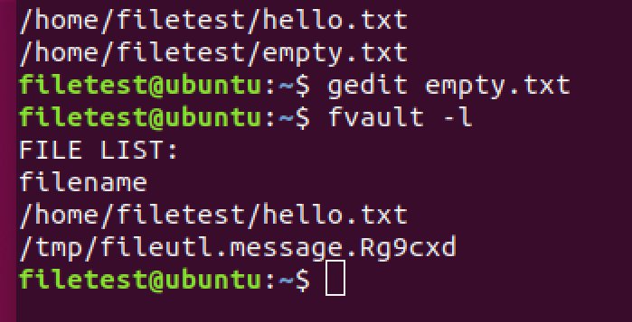

# FileVaultSJTU

上海交通大学

系统软件课程设计课程，Linux内核模块编程

实现基于系统调用重载的加密型文件保险箱

## 系统组成及运行

内核态编写了系统调用重载的内核模块，重载文件相关的系统调用，重载后的系统调用根据数据库的内容决定所执行的操作。

用户态编写了客户端和服务器，客户端使用CLI进行操作，完成参数的解析，服务器对SQLITE数据库进行操作，同时响应内核模块的查询请求。

客户端和服务器使用UNIX域socket通信。服务器与内核模块使用netlink通信。

## 现存问题和解决方案

1. - [x] 无法完成文件加解密，需要完善。

   通过修改kernel/crypto.c文件已经解决，主要是修改了加密的内存操作的部分，使用kmalloc和kfree结合copy_from_user/copy_to_user函数实现。

2. - [x] 文件加入和移除保险箱时的加解密操作

   通过在客户端添加文件复制和备份实现。

3. - [x] 删除文件后数据库内保存的文件名信息出错

   1. 例如使用gedit处理文件时，gedit会把原本的文件缓存起来，当修改完毕保存时将新的文件写入，此时会出现数据库内保存的inode节点号对应的文件改变，新的文件并没有自动加入保险箱内，导致出现错误。
   

   2. 由于数据库中保存的为文件的inode节点号，当文件删除后相同的inode可以被再次利用并分配给不同的文件，因此这个问题在当前程序框架下难以解决，我们通过严格禁止文件保险箱内的删除和重命名操作来避免出现这样的问题。

4. - [ ] 可执行文件加入保险箱后是否可以正常运行

   1. - [ ] 使用gcc编译C语言得到的可执行文件：Exec Format Error
   2. - [x] 使用cat将python文件读取写入：成功

5. - [ ] 多文件格式的支持：

   在前期的测试和演示过程中，为了方便我们都是使用txt文件上的cat/echo命令进行测试，但是一个合格的文件保险箱应该支持多种文件格式。在下列常见文件格式上测试结果如下：

   1. - [x] png文件：成功
   2. - [ ] pdf文件：显示文件格式被破坏
   3. - [ ] doc文件：打开为乱码

6. 其他问题：

   1. 设计实现GUI界面。
   2. 增加审计单元，记录保险箱内部文件的读写访问。
   3. 添加用户可修改的配置文件，便于灵活的配置/删去功能。
   4. 重载更多的系统调用，支持更多的功能。
